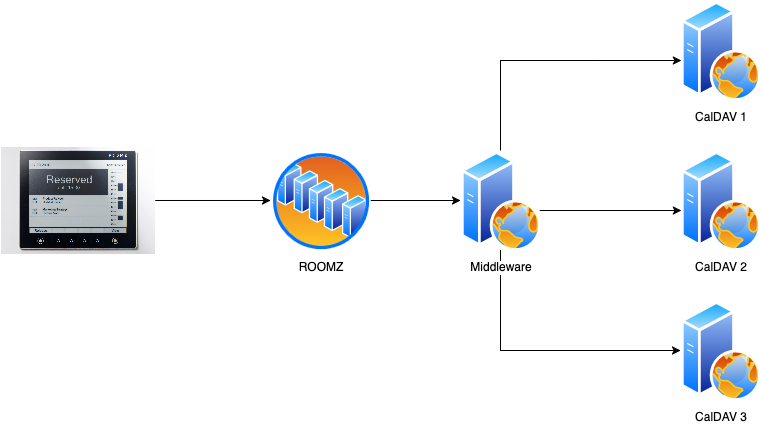

<!-- markdownlint-disable MD041 MD013 -->

[](https://github.com/minidfx/elixir-roomz-caldav-to-generic-connector/actions/workflows/docker-publish.yml)

# Middleware between your CalDAV servers and ROOMZ

This small server operates as a proxy in front of your CalDAV servers, providing
an opportunity to protect calendars publicly shared and readable by ROOMZ to
display your events on the [display](https://roomz.io/meeting-room-solution).

This server middleware can fetch events from multiple servers (up to 4)
configured using environment variables and prefetch images if applicable
to be consumed by the ROOMZ servers.



> **INFO**: More info about the ROOMZ Connector contracts is available on their
> [support page](https://roomzio.atlassian.net/wiki/spaces/SUP/pages/282755076/ROOMZ+Connector).

## Why this project?

It was created for my personal usage because I left Google for my family calendars
and I've a server with the CalDAV protocol. [ROOMZ](https://roomz.io) doesn't
support the [CalDAV](https://en.wikipedia.org/wiki/CalDAV) protocol yet.

## Security

**IMPORTANT**: The server is protected by basic authentication. Ensure you
only use it through a TLS layer.

## Prefetch images (best effort)

When the middleware fetches events from your CalDAV servers, if an event
contains a URL, it will attempt to download and make the image compatible
for the ROOMZ display, if applicable.

This process is executed concurrently and will make the image available for
subsequent calls. This is a best-effort approach to prevent slowing down the
server request. If your events have been available for an extended period and
are well-configured, all images will be ready at the appropriate time.

You can disable this process by setting the variable
`PREFETCH_IMAGES` to `false`.

## How to use it?

### Docker

The easiest way is to use Docker, configure the environment variables
and run it!

```yaml
services:
  app:
    image: minidfx/roomz-caldav-to-generic-connector:0.1
    ports:
      - 80:4000/tcp
    build:
      context: .
    environment:
      - PORT=4000
      - BASIC_AUTH_USERNAME=<username>
      - BASIC_AUTH_PASSWORD=<password>
      - SERVER_URL_0=<url>
      - SERVER_USERNAME_0=<username>
      - SERVER_PASSWORD_0=<password>
      - SERVER_URL_1=<url>
      - SERVER_USERNAME_1=<username>
      - SERVER_PASSWORD_1=<password>
      - PREFETCH_IMAGES=<true|false>
      - CALDAV_SERVER_TIMEOUT=10000
```

<!-- markdownlint-disable MD013 -->

| Variable                | Description                                                                 | Example                                       |
| ----------------------- | --------------------------------------------------------------------------- | --------------------------------------------- |
| `BASIC_AUTH_USERNAME`   | The username used to authenticate the communication                         |                                               |
| `BASIC_AUTH_PASSWORD`   | The password used to authentication the communication                       |                                               |
| `SERVER_URL_X`          | CalDAV server URL (X represents the index of your CalDAV server)            | for owncloud: `https://<host>/remote.php/dav` |
| `SERVER_USERNAME_X`     | User's CalDAV username (X represents the index of your CalDAV server)       |                                               |
| `SERVER_PASSWORD_X`     | User's CalDAV password (X represents the index of your CalDAV server)       |                                               |
| `PREFETCH_IMAGES`       | Whether the middleware should attempt to fetch and convert images for ROOMZ |                                               |
| `CALDAV_SERVER_TIMEOUT` | Maximum time in milliseconds to wait for requests sent to a CalDAV server   | default: 10000ms                              |

<!-- markdownlint-enable MD013 -->

## CURL request to test the API

### Get the available rooms

```bash
curl -X GET -u "username:password" http://localhost:4000/rooms
```

### Get the meetings

```bash
curl -X GET -u "username:password" http://localhost:4000/rooms/<room-id>/meetings?from<iso8601>&to=<iso8601>
```

### Create a meeting

```bash
curl -H "Content-Type: application/json" -X POST -d '{"subject": "My Subject", "organizerId": "my-organizer-id", "startDateUTC": "2020-01-01T12:00:00Z", "endDateUTC": "2020-01-01T12:00:00Z"}' -u "username:password" http://localhost:4000/rooms/<room-id>/meetings
```

### Update a meeting

```bash
curl -H "Content-Type: application/json" -X PUT -d '{"startDateUTC": "2020-01-01T12:00:00Z", "endDateUTC": "2020-01-01T12:00:00Z"}' -u "username:password" http://localhost:4000/rooms/<room-id>/meetings/<meeting-id>
```

<!-- markdownlint-enable MD013 -->
