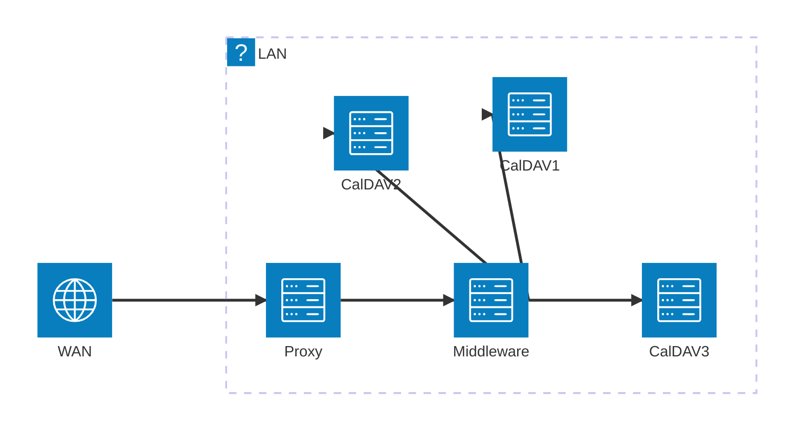

# Middleware between your CalDAV servers and ROOMZ

This small server operates as proxy in front of your CalDAV servers. Giving you the
opportunity to protect the calendars publicitly shared and readable by ROOMZ to display
your events on the [display](https://roomz.io/meeting-room-solution).

This server middleware can fetch the events from many servers configured using the
environment variables.

## Why this project?

It was created for my personal usage because I left Google for my family calendars
and I've a server with the CalDAV protocol. [ROOMZ](https://roomz.io) doesn't
support the [CalDAV](https://en.wikipedia.org/wiki/CalDAV) protocol.

## ROOMZ Connector

The [API description](https://roomzio.atlassian.net/wiki/spaces/SUP/pages/282755076/ROOMZ+Connector)
is provided by [ROOMZ](https://roomz.io).


```mermaid
architecture-beta
    group lan(streamline:network)[LAN]

    service wan(internet)[WAN]
    service gateway(server)[Proxy] in lan
    service server(server)[Middleware] in lan

    service caldav1(server)[CalDAV1] in lan
    service caldav2(server)[CalDAV2] in lan
    service caldav3(server)[CalDAV3] in lan

    wan:R --> L:gateway
    gateway:R --> L:server

    server:R --> L:caldav1
    server:R --> L:caldav2
    server:R --> L:caldav3
```

**WARNING**: The API is protected by the basic authentication, make sure to
use it ONLY through the TLS layer.

### Prefetch images

When the middleware fetch the events from your CalDAV servers, by default
it will try to determine the image format, its size and then try to
download it and make it compatible for ROOMZ for any events in the future.
This process can be expensive and can be disabled by setting the variable
`PREFETCH_IMAGES` to `false`.

## How to use it?

### Docker

The easiest way is to use Docker, configure the environment variables
and run it!

```yaml
services:
  app:
    image: minidfx/roomz-caldav-to-generic-connector:0.1
    ports:
      - 80:4000/tcp
    build:
      context: .
    environment:
      - PORT=4000
      - BASIC_AUTH_USERNAME=<username>
      - BASIC_AUTH_PASSWORD=<password>
      - SERVER_URL_0=<url>
      - SERVER_USERNAME_0=<username>
      - SERVER_PASSWORD_0=<password>
      - SERVER_URL_1=<url>
      - SERVER_USERNAME_1=<username>
      - SERVER_PASSWORD_1=<password>
      - PREFETCH_IMAGES=<true|false>
```

<!-- markdownlint-disable MD013 -->

| Variable                | Description                                                                               | Example                                       |
| ----------------------- | ----------------------------------------------------------------------------------------- | --------------------------------------------- |
| `BASIC_AUTH_USERNAME`   | The username used to authenticate the communication                                       |                                               |
| `BASIC_AUTH_PASSWORD`   | The password used to authentication the communication                                     |                                               |
| `SERVER_URL_X`          | The CalDAV server url                                                                     | for owncloud: `https://<host>/remote.php/dav` |
| `SERVER_USERNAME_X`     | The user CalDAV username                                                                  |                                               |
| `SERVER_PASSWORD_X`     | The user CalDAV password                                                                  |                                               |
| `PREFETCH_IMAGES`       | If the middleware has to try to fetch the image given in the URL and convert it for ROOMZ |                                               |
| `CALDAV_SEVERS_TIMEOUT` | The maximum time in milliseconds to wait for the requests sent to a CalDAV server         | default: 10000ms                              |

<!-- markdownlint-enable MD013 -->

## Test the API

### Get the available rooms

<!-- markdownlint-disable MD013 -->

```bash
curl -X GET -u "username:password" http://localhost:4000/rooms
```

### Get the meetings

```bash
curl -X GET -u "username:password" http://localhost:4000/rooms/<room-id>/meetings?from<iso8601>&to=<iso8601>
```

### Create a meeting

```bash
curl -H "Content-Type: application/json" -X POST -d '{"subject": "My Subject", "organizerId": "my-organizer-id", "startDateUTC": "2020-01-01T12:00:00Z", "endDateUTC": "2020-01-01T12:00:00Z"}' -u "username:password" http://localhost:4000/rooms/<room-id>/meetings
```

### Update a meeting

```bash
curl -H "Content-Type: application/json" -X PUT -d '{"startDateUTC": "2020-01-01T12:00:00Z", "endDateUTC": "2020-01-01T12:00:00Z"}' -u "username:password" http://localhost:4000/rooms/<room-id>/meetings/<meeting-id>
```

<!-- markdownlint-enable MD013 -->
